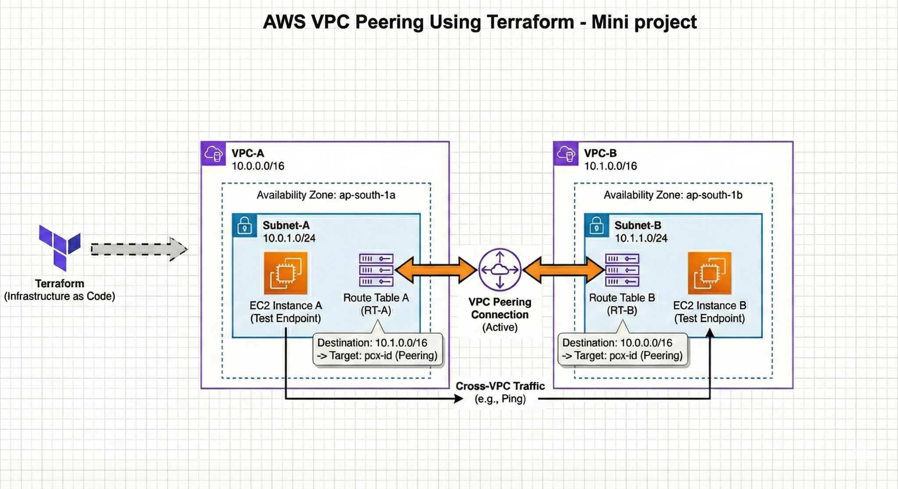

# Terraform_VPC_Peering
Pipeline Status:

| Repository Name | Author    | Workflow Status                      |
| :--------       | :------- | :-------------------------------- |
| `Terraform_VPC_Peering`            | `iamdevops995` | [](https://github.com/iamdevops995/Terraform_VPC_Peering/actions/workflows/tf-workflow.yml) |


### 𝗣𝗿𝗼𝗷𝗲𝗰𝘁 𝗢𝘃𝗲𝗿𝘃𝗶𝗲𝘄
This project focuses on building a scalable and secure AWS networking setup by creating two independent VPCs and connecting them through a VPC Peering connection, fully automated using Terraform.


### Infrastructure Diagram:

<p align="center">
  
</p>

**Note:** Assign required IAM policy to you account.

🔧 𝗜𝗺𝗽𝗹𝗲𝗺𝗲𝗻𝘁𝗲𝗱

- 🔹Created VPC-A and VPC-B with custom CIDR ranges
- 🔹Configured subnets, route tables, and routing rules
- 🔹Established VPC Peering for private inter-VPC communication
- 🔹Validated connectivity using EC2 instances and ICMP testing
- 🔹Implemented everything using Terraform IaC

🛠️ 𝗧𝗲𝗰𝗵 𝗦𝘁𝗮𝗰𝗸

- 🔹AWS 
- 🔹Terraform 
- 🔹VPC 
- 🔹Subnets 
- 🔹Route Tables 
- 🔹EC2 
- 🔹Networking
- 🔹EC2 Instance ( for Testing the connection from vpc a->b and b->a)

# Terraform cmds:

**Terraform Initialization**
```
terraform init
```

**Terraform validate**
```
terraform validate
```

**Terraform format**
```
terraform fmt
```

**Terraform Plan**
```
terraform plan
```

**Terraform apply**
```
terraform apply --auto-approve
```
